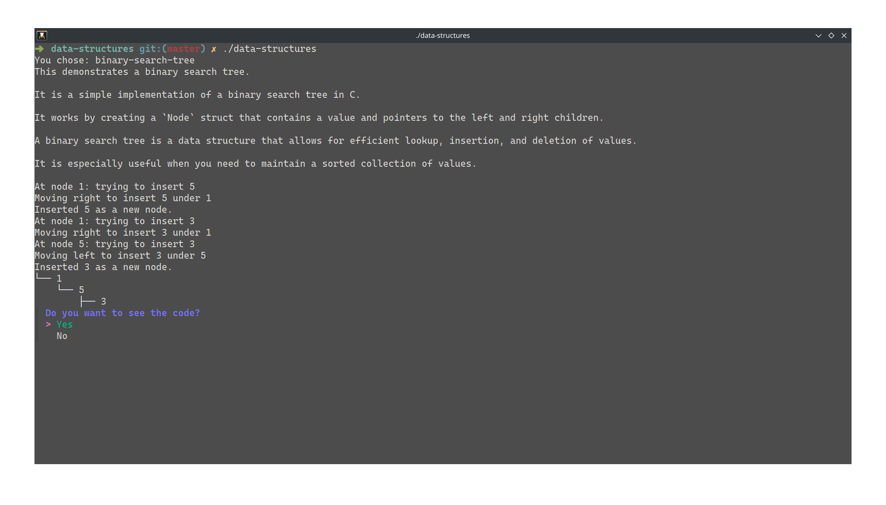

# Structure-Walker
<div style="display: flex; align-items: center; justify-content: space-between; gap: 20px; flex-direction: column">
  
  <iframe 
    width="500" 
    height="200" 
    src="https://www.youtube.com/embed/SJS8YsVZxYE" 
    title="Structure Walker - Hack Club Demo" 
    frameborder="0" 
    allow="accelerometer; autoplay; clipboard-write; encrypted-media; gyroscope; picture-in-picture; web-share" 
    referrerpolicy="strict-origin-when-cross-origin" 
    allowfullscreen 
    style="height: 200px; width: 500px;">
  </iframe>
</div>

<br>

**Structure-Walker** is an interactive demonstration and walkthrough of data structures, written in C and Go. It utilizes C for data structure implementation and Go for interactivity and walkthrough features.

## Features
- Interactive demonstration of various data structures.
- Walkthroughs to understand how each data structure works.
- Written in C (for data structures) and Go (for interactivity).

## Usage

To use the project, run the compiled executable. You can either download it from the [releases page](#) (work in progress) or compile it manually.

Once run, the program will interactively guide you.

### Running the Application

```sh
./data-structures
```

or on Windows:

```pwsh
./data-structures.exe
```

## Compiling

### Prerequisites

This project uses C for data structure implementation and requires the following:

- **C Library:** `murmurhash.c` for hashing in the hash table. You can install it from its [GitHub repository](https://github.com/jwerle/murmurhash.c). Make sure it's placed in `/usr/local/lib` or update the path as needed in the source code.

- **Go Modules:** Download Go modules with:

  ```sh
  go mod download
  ```

### Build Instructions

1. **Compile the Project**

   ```sh
   go build .
   ```

2. **Run the Application**

   ```sh
   ./data-structures
   ```

   or on Windows:

   ```pwsh
   ./data-structures.exe
   ```

## Contributing

If you’d like to contribute, please fork the repository and submit a pull request. See [CONTRIBUTING.md](CONTRIBUTING.md) for more details.

## License

This project is licensed under the MIT License. See [LICENSE](LICENSE) for details.
